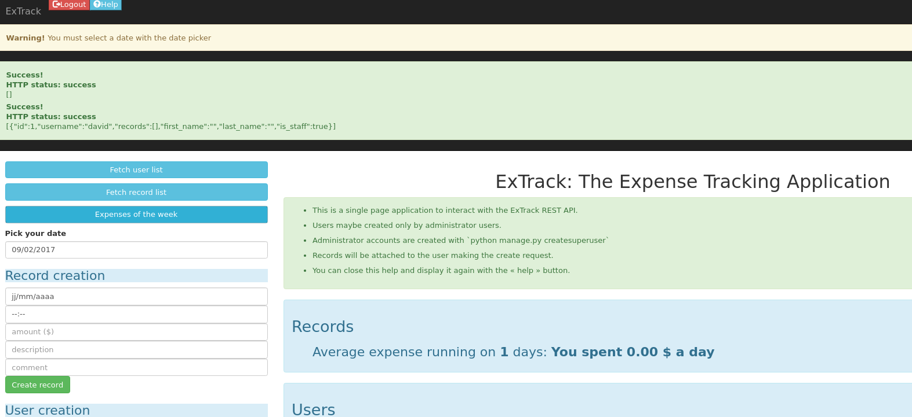

# expensetrack

Expense Track is:

+ a Simple REST API based on the [Django Rest Framework](http://www.django-rest-framework.org/).
+ a [python CLI client](cli) for the API.
+ a [JavaScript Single Page Application](front) based on the jQuery library.

# Documentation

- [Installation Guide](doc/INSTALL.md)
- [Readme for the user interface](doc/README-UI.md)
- [Readme for the REST API](doc/README-API.md)

